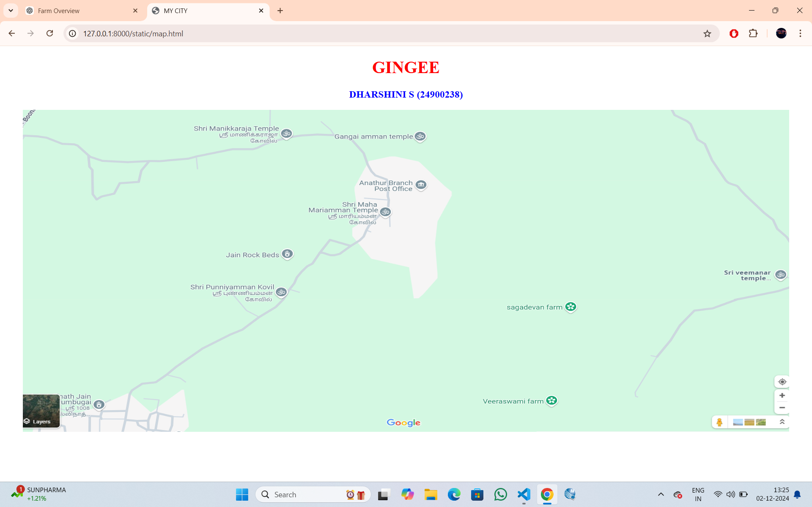
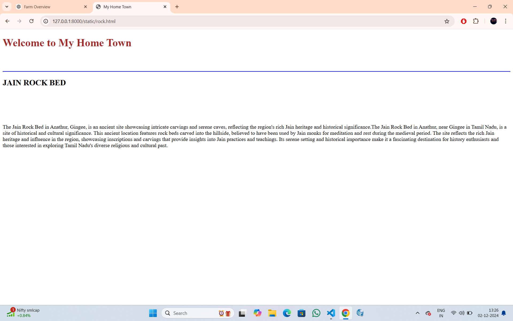
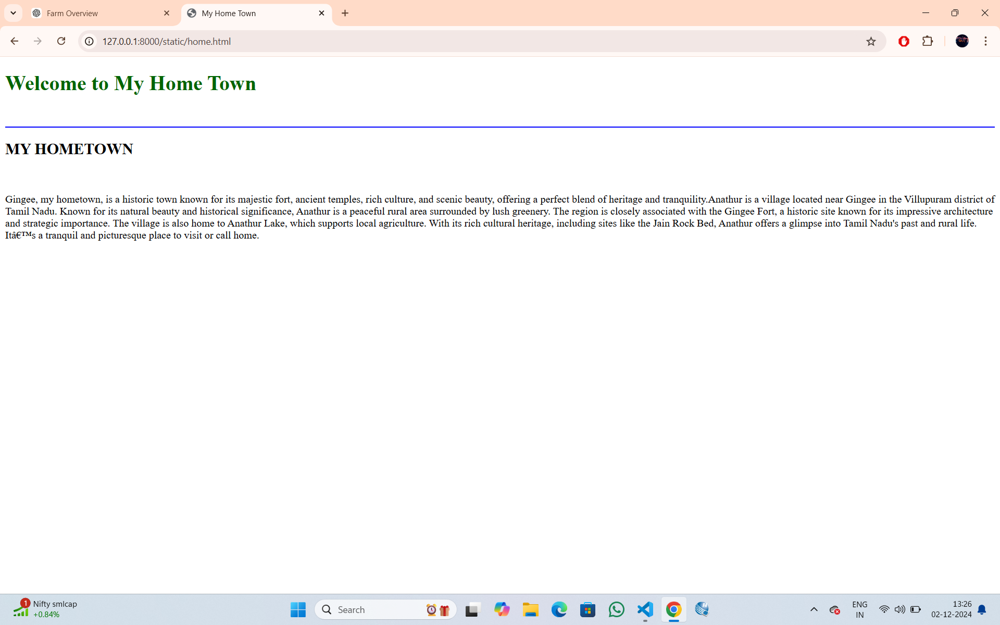
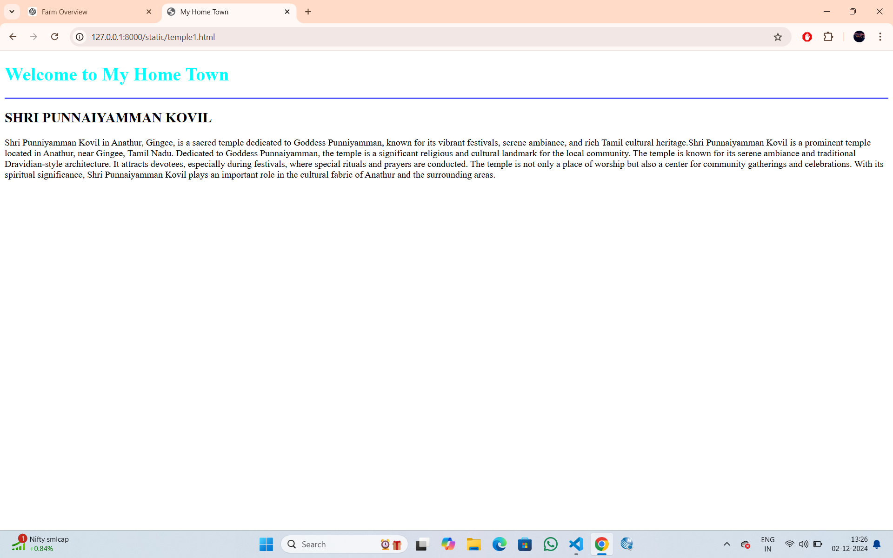
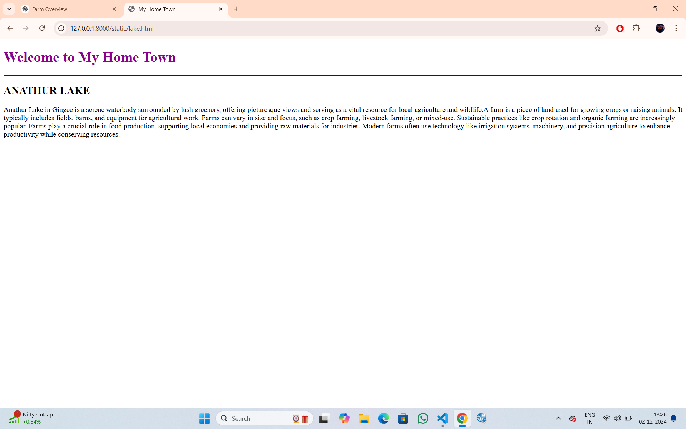
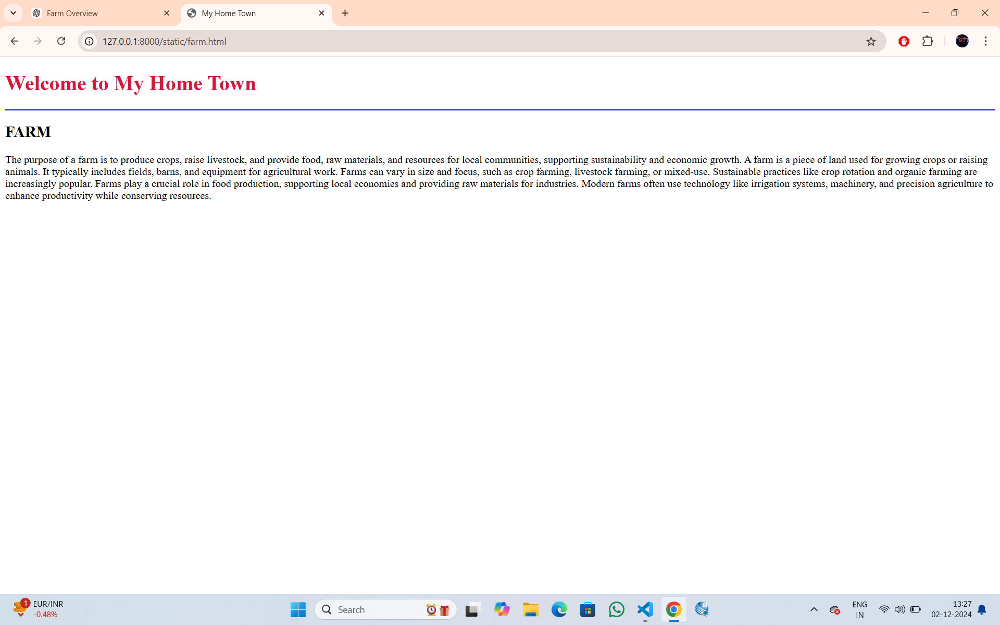

# Ex04 Places Around Me
## Date: 02/12/2024

## AIM
To develop a website to display details about the places around my house.

## DESIGN STEPS

### STEP 1
Create a Django admin interface.

### STEP 2
Download your city map from Google.

### STEP 3
Using ```<map>``` tag name the map.

### STEP 4
Create clickable regions in the image using ```<area>``` tag.

### STEP 5
Write HTML programs for all the regions identified.

### STEP 6
Execute the programs and publish them.

## CODE

```

map.html


<!DOCTYPE html>
<html lang="en">
<head>
    <meta charset="UTF-8">
    <meta name="viewport" content="width=device-width, initial-scale=1.0">
    <title>MY CITY</title>
    <style>
        area {
            cursor: pointer;
        }
    </style>
</head>
<body>
    <h1 align="center" style="color: red;"><b>GINGEE</b></h1>
    <h3 align="center" style="color: blue;"><b>DHARSHINI S (24900238)</b></h3>
    <center>
        
        <map name="mycity">
            <area shape="circle" coords="450,350,70" href="temple1.html" title="TEMPLE">
            <area shape="circle" coords="690,200,150" href="home.html" title="HOMETOWN">
            <area shape="circle" coords="650,50,100" href="lake.html" title="LAKE">
            <area shape="circle" coords="900,550,100" href="farm.html" title="FARM">
            <area shape="circle" coords="460,300,80" href="rock.html" title="ROCK">
        </map>
    </center>
</body>
</html>


home.html


<!DOCTYPE html>
<html lang="en">
<head>
    
    <title>My Home Town</title>
    
</head>
<body>

        <h1 style="color:darkgreen;" style="font-family: fantasy; background-color: beige;">Welcome to My Home Town</h1><br>
        <hr color="blue">
        <h2>MY HOMETOWN</h2><br>
        <p>Gingee, my hometown, is a historic town known for its majestic fort, ancient temples, rich culture,
             and scenic beauty, offering a perfect blend of heritage and tranquility.Anathur is a village located near 
             Gingee in the Villupuram district of Tamil Nadu. Known for its natural beauty and historical significance, 
             Anathur is a peaceful rural area surrounded by lush greenery. The region is closely associated with the Gingee
             Fort, a historic site known for its impressive architecture and strategic importance. The village is also 
             home to Anathur Lake, which supports local agriculture. With its rich cultural heritage, including sites 
             like the Jain Rock Bed, Anathur offers a glimpse into Tamil Nadu's past and rural life. It’s a tranquil and 
             picturesque place to visit or call home.
 </p>
    
</body>
</html>


lake.html


<!DOCTYPE html>
<html lang="en">
<head>
    
    <title>My Home Town</title>
    
</head>
<body>

        <h1 style="color:darkgreen;" style="font-family: fantasy; background-color: beige;">Welcome to My Home Town</h1><br>
        <hr color="blue">
        <h2>MY HOMETOWN</h2><br>
        <p>Gingee, my hometown, is a historic town known for its majestic fort, ancient temples, rich culture,
             and scenic beauty, offering a perfect blend of heritage and tranquility.Anathur is a village located near 
             Gingee in the Villupuram district of Tamil Nadu. Known for its natural beauty and historical significance, 
             Anathur is a peaceful rural area surrounded by lush greenery. The region is closely associated with the Gingee
             Fort, a historic site known for its impressive architecture and strategic importance. The village is also 
             home to Anathur Lake, which supports local agriculture. With its rich cultural heritage, including sites 
             like the Jain Rock Bed, Anathur offers a glimpse into Tamil Nadu's past and rural life. It’s a tranquil and 
             picturesque place to visit or call home.
 </p>
    
</body>
</html>


rock.html


<!DOCTYPE html>
<html lang="en">
<head>
    
    <title>My Home Town</title>
    
</head>
<body>

        <h1 style="color:brown;" style="font-family: fantasy; background-color: cornsilk;">Welcome to My Home Town</h1><BR></BR>
        <hr color="blue">
        <h2>JAIN ROCK BED</h2><BR><BR></BR></BR>
        <p>The Jain Rock Bed in Anathur, Gingee, is an ancient site showcasing intricate carvings and serene caves, 
            reflecting the region's rich Jain heritage and historical significance.The Jain Rock Bed in Anathur, near Gingee in
            Tamil Nadu, is a site of historical and cultural significance. This ancient location features rock beds carved into
            the hillside, believed to have been used by Jain monks for meditation and rest during the medieval period. 
            The site reflects the rich Jain heritage and influence in the region, showcasing inscriptions and carvings that
            provide insights into Jain practices and teachings. Its serene setting and historical importance make it a
            fascinating destination for history enthusiasts and those interested in exploring Tamil Nadu's diverse religious 
            and cultural past.
</p>
    
</body>
</html>


temple1.html


<!DOCTYPE html>
<html lang="en">
<head>
    
    <title>My Home Town</title>
    
</head>
<body>

        <h1 style="color: aqua;" style="font-family: fantasy; background-color: antiquewhite;">Welcome to My Home Town</h1>
        <hr color="blue">
        <h2>SHRI PUNNAIYAMMAN KOVIL</h2>
        <p>Shri Punniyamman Kovil in Anathur, Gingee, is a sacred temple dedicated to Goddess Punniyamman,
            known for its vibrant festivals, serene ambiance, and rich Tamil cultural heritage.Shri Punnaiyamman Kovil
            is a prominent temple located in Anathur, near Gingee, Tamil Nadu. Dedicated to Goddess Punnaiyamman,
            the temple is a significant religious and cultural landmark for the local community. The temple is known
            for its serene ambiance and traditional Dravidian-style architecture. It attracts devotees, especially during 
            festivals, where special rituals and prayers are conducted. The temple is not only a place of worship but also
            a center for community gatherings and celebrations. With its spiritual significance, Shri Punnaiyamman Kovil 
            plays an important role in the cultural fabric of Anathur and the surrounding areas.
            </p>
    
</body>
</html>


farm.html


<!DOCTYPE html>
<html lang="en">
<head>
    
    <title>My Home Town</title>
    
</head>
<body>

        <h1 style="color:crimson;" style="font-family:serif; background-color: bisque;">Welcome to My Home Town</h1>
        <hr color="blue">
        <h2><B> FARM </B></h2>
        <p>The purpose of a farm is to produce crops, raise livestock, and provide food, 
            raw materials, and resources for local communities, supporting sustainability and economic growth.
            A farm is a piece of land used for growing crops or raising animals. It typically includes fields, barns, and equipment for
             agricultural work. Farms can vary in size and focus, such as crop farming, livestock farming, or mixed-use. Sustainable practices 
             like crop rotation and organic farming are increasingly popular. Farms play a crucial role in food production, supporting local 
             economies and providing raw materials for industries. Modern farms often use technology like irrigation systems, 
             machinery, and precision agriculture to enhance productivity while conserving resources.
</p>
    
</body>
</html>

```
## OUTPUT









## RESULT
The program for implementing image maps using HTML is executed successfully.
